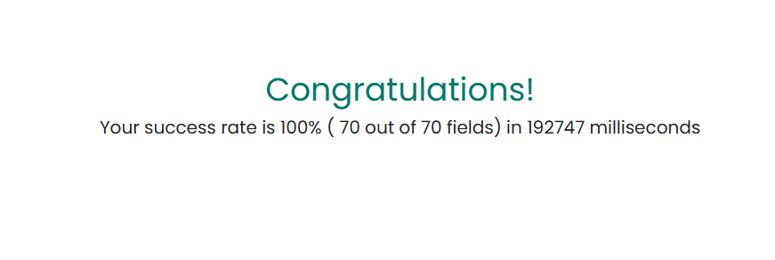
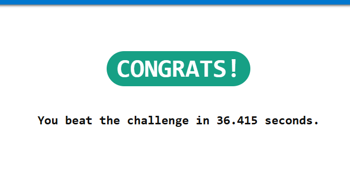

# Automação Web com UiPath

Este projeto de UiPath executa um processo de automação de duas etapas, projetado para interagir com sistemas web, processar arquivos e consolidar dados.

## Funcionalidades

O robô é dividido em duas etapas principais:

### Etapa 1: Preenchimento de Formulário Web

Nesta fase, o robô lê os dados de uma planilha Excel (`arquivos/challenge.xlsx`) e os utiliza para preencher e enviar um formulário em uma aplicação web. O objetivo é inserir múltiplos registros de forma automatizada, aumentando a eficiência e reduzindo erros manuais.

### Etapa 2: Extração de Dados de Faturas (Invoices)

A segunda etapa consiste em baixar faturas (invoices) de um sistema, extrair informações relevantes de cada uma e consolidar esses dados em um único arquivo CSV (`arquivos/Dados.csv`). Este processo otimiza a coleta de dados financeiros ou de faturamento.

## Estrutura do Projeto

- **`Main.xaml`**: Orquestrador principal do robô, responsável por invocar as duas etapas do processo.
- **`ProcessBox/`**: Contém os fluxos de trabalho (workflows) para cada etapa.
  - `PrimeiroProcesso/`: Lógica para o preenchimento do formulário.
  - `SegundoProcesso/`: Lógica para o download e extração dos dados das faturas.
- **`arquivos/`**: Armazena os arquivos de dados utilizados e gerados pelo robô.
  - `challenge.xlsx`: Planilha de entrada para a Etapa 1.
  - `Dados.csv`: Arquivo de saída gerado na Etapa 2.
- **`project.json`**: Arquivo de configuração do projeto, com dependências e metadados.

## Como Executar

1.  **Abra o projeto** no UiPath Studio.
2.  **Restaure as dependências** do projeto, se necessário.
3.  **Verifique os dados de entrada** no arquivo `arquivos/challenge.xlsx`.
4.  **Execute o projeto** a partir do `Main.xaml`.

## Resultados da Execução

As imagens abaixo confirmam a execução bem-sucedida de ambas as etapas do processo de automação.

**Sucesso da Etapa 1 - Preenchimento do Formulário:**

**Sucesso da Etapa 2 - Consolidação dos Dados:**

---
*Este RPA foi criado como parte do desafio do curso "Automatize Processos com Erimatéia".*